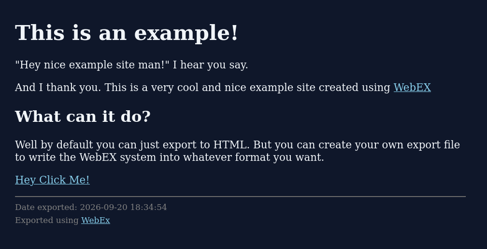

# WebEX

WebEX is a system that let's you define page elements and exports them to user-defined formats, such as HTML and Markdown.

Mainly used for [my personal website](https://svngms.neocities.org/)

```lisp
  (create-site 'example "Example Site")

  (create-page example "Index" "/index"
               ;; Make sure we use the stylesheet
               (html-add-styling "/style.css")
               ;; Write our page
               (add-heading "This is an example!")
               (add-paragraph (create-text "\"Hey nice example site man!\" I hear you say."))
               (add-paragraph (create-text "And I thank you. This is a very cool and nice example site created using ")
                              (create-link "WebEX" "https://codeberg.org/svngms/WebEX"))
               (add-subheading "What can it do?")
               (add-paragraph (create-text "Well by default you can just export to HTML. But you can create your own export file to write the WebEX system into whatever format you want."))
               (add-link "Hey Click Me!" "/other-page/"))

  (export-to-html example)
```



## Current language support

 - HTML
 - RSS (exports only to one file)

More will be added in future as I need them

## Inspired by

 - [kew](https://github.com/uint23/kew)
 - [werc](https://werc.cat-v.org/)

## License

The license is [Unlicense](https://unlicense.org/).
